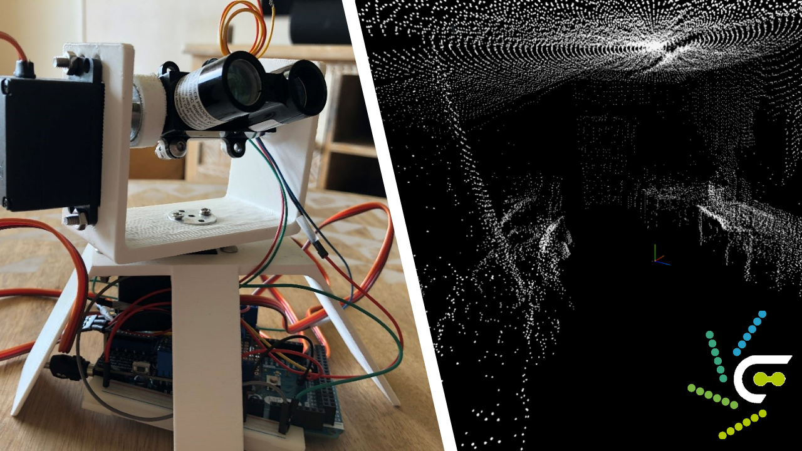

<div align="center">
    
    <h1>LiDAR 3D Cartography (Engineering project)</h1>
    <h3>An engineering project made for high-school diploma</h3>
    <a href="docs/en/project-file-en.pdf">🇬🇧 Project file</a> - <a href="docs/fr/dossier-projet-fr.pdf">🇫🇷 Dossier projet</a>
</div>

This repository contains the project made by Kylian Capitanio and myself (Théo Vidal) for the Engineering Sciences course for high school diploma. The aim was to perform a 3D scan of a room using a LiDAR scanner and a custom 3D-printed platform, transmitting data by remote communication and previewing the result using a custom-made program. We applied an engineering approach for this problem, by defining the needs and specifications, dividing up tasks, developing the solution and testing it in real conditions.

## 💻 Development

Clone the repository from GitHub on your local machine : (this requires Git to be installed)

```bash
git clone https://github.com/theovidal/3d-cartography-platform.git  # Using HTTP
git clone git@github.com:theovidal/3d-cartography-platform          # Using SSH
```

Install the required dependencies using your favorite package manager :

```bash
npm install   # Using NPM
yarn install  # Using Yarn
```

Then, run the renderer process using the `dev` script, and the Electron app with `start` :

```bash
npm run dev  # Using NPM
yarn dev     # Using Yarn

npm run start  # Using NPM
yarn start     # Using Yarn
```

A web server will start with hot reload enabled, perfect to develop.

### Building the app

To get a built version of the renderer ready to be served by a HTTP server, use the `build` command :

```bash
npm run build  # Using NPM
yarn build     # Using Yarn
```

Files will be generated in the `dist` folder.

To build the app, use the GitHub action that uses electron-builder or the software itself:

```bash
electron-build --windows --mac --linux
```

To upload the [hardware script](./hardware/hardware.ino) on your card, open it in your Arduino IDE.

## 📜 Credits

- Built by [Théo Vidal](https://github.com/theovidal) and Kylian Capitanio
- Made in Lycée Polyvalent J.-M. Carriat, 01000 Bourg-en-Bresse, France
